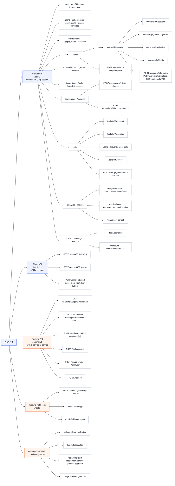
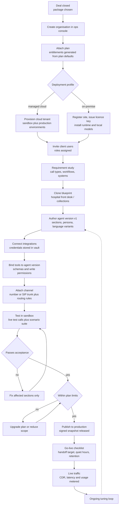
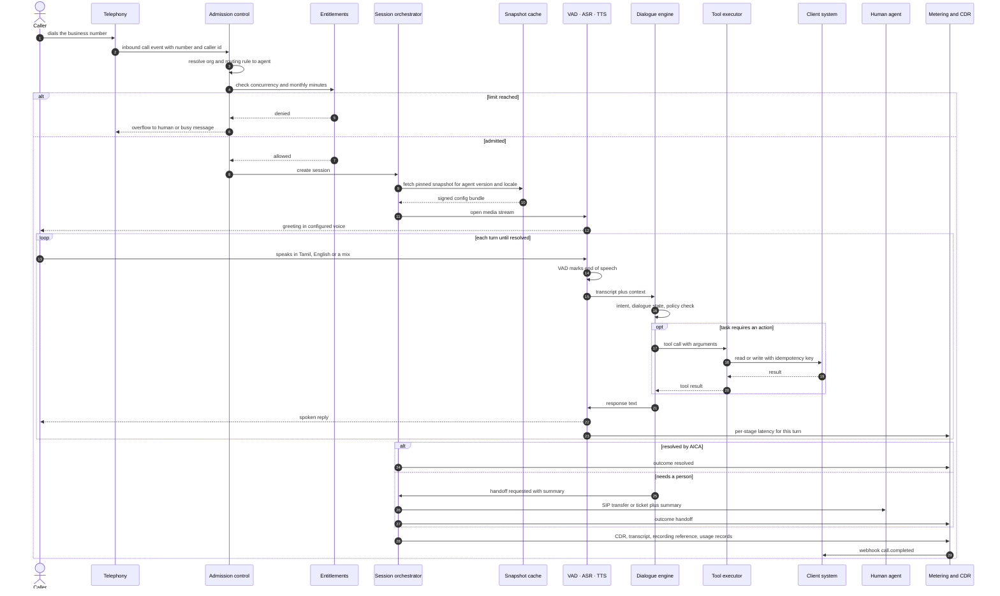
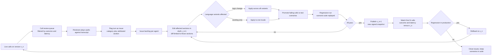

# AICA — System Design Diagrams

Multi-tenant platform for bitNtech: every client is an organisation, every organisation
has its own AICA configuration, and each may run multiple agents within the limits of
its plan.

Diagrams:

1. Overall architecture
2. Database design (ER)
3. API hierarchy
4. User flow — client onboarding and go-live
5. User flow — inbound call at runtime
6. User flow — tuning loop (call review to published fix)

---

## 1. Overall architecture

```mermaid
flowchart TB
    classDef ctl fill:#EEF2FF,stroke:#1B4DF0,color:#0B1220
    classDef rt fill:#FFF4EC,stroke:#F26522,color:#0B1220
    classDef store fill:#F5F7FB,stroke:#8A93A2,color:#0B1220
    classDef ext fill:#FFFFFF,stroke:#B4BCC9,color:#0B1220,stroke-dasharray: 4 3

    subgraph ACT["Actors"]
        CALLER["Caller or customer<br/>PSTN · WhatsApp · web"]
        CSTAFF["Client staff<br/>front desk, supervisor"]
        BOPS["bitNtech ops and delivery team"]
    end

    subgraph UI["Surfaces"]
        CONSOLE["Ops console<br/>all tenants, provisioning, margin"]
        PORTAL["Client portal<br/>single tenant, calls and analytics"]
        DESIGNER["Agent designer<br/>versions · sections · language variants"]
    end

    subgraph CP["Control plane"]
        GW["API gateway<br/>auth, org scoping, rate limits"]
        PROV["Provisioning and blueprint service"]
        AGENTSVC["Agent config service<br/>draft · version · variant · diff"]
        PUB["Snapshot publisher<br/>signs immutable config bundles"]
        ENT["Entitlements service<br/>plan limits per org"]
        METER["Metering and billing"]
        INTREG["Integration registry<br/>connectors and tool schemas"]
        QA["QA and regression runner"]
        ANALYTICS["Analytics and reporting"]
        AUDITSVC["Audit, consent and retention"]
    end

    subgraph CH["Channels and ingress"]
        SIP["SIP trunk or telephony provider"]
        WA["WhatsApp BSP"]
        WEB["Web or in-app widget"]
        DIALER["Outbound dialer<br/>campaigns, retries, quiet hours"]
    end

    subgraph RT["Voice runtime — data plane"]
        ADMIT["Admission control<br/>routing plus limit check"]
        MEDIA["Media gateway<br/>RTP and websocket audio"]
        ORCH["Session orchestrator<br/>per-call state machine"]
        CACHE["Snapshot cache<br/>version pinned at call start"]
        VAD["VAD · turn-taking · barge-in"]
        ASR["ASR<br/>code-mixed speech"]
        DIALOG["Conversational intelligence<br/>intent · context · policy"]
        TOOLS["Tool and agent executor"]
        TTS["TTS<br/>mixed-language output"]
        TRACE["Latency tracer<br/>per-stage timings"]
    end

    subgraph MODELS["Model layer"]
        ROUTER["Provider router<br/>per stage, with fallback"]
        CLOUDM["Cloud model providers"]
        EDGEM["Local and edge models"]
    end

    subgraph DATA["Data and storage"]
        PG[("Postgres<br/>control plane state")]
        REDIS[("Redis<br/>session state and cache")]
        OBJ[("Object store<br/>recordings and audio")]
        VEC[("Vector store<br/>knowledge bases")]
        WH[("Warehouse<br/>CDR, turns, metrics")]
        VAULT[("Secrets vault<br/>per-tenant credentials")]
    end

    subgraph CSYS["Client systems"]
        HIS["HIS or HMIS · CRM · LOS"]
        CAL["Calendar and slot system"]
        HOOK["Client webhooks"]
        HUMAN["Human handoff<br/>SIP transfer · desk · ticket"]
    end

    subgraph DEP["Deployment profiles"]
        CLOUD["Managed cloud<br/>shared multi-tenant"]
        ONPREM["On-premise or edge node<br/>licence file, local snapshot and models"]
    end

    CALLER --> SIP
    CALLER --> WA
    CALLER --> WEB
    DIALER --> SIP

    SIP --> ADMIT
    WA --> ADMIT
    WEB --> ADMIT
    ADMIT -- "limit check" --> ENT
    ADMIT --> MEDIA
    MEDIA --> ORCH
    ORCH --> CACHE
    CACHE -- "pull signed snapshot" --> PUB

    ORCH --> VAD
    VAD --> ASR
    ASR --> DIALOG
    DIALOG --> TOOLS
    DIALOG --> TTS
    TOOLS --> TTS
    TTS --> MEDIA

    ASR --> ROUTER
    DIALOG --> ROUTER
    TTS --> ROUTER
    ROUTER --> CLOUDM
    ROUTER --> EDGEM

    DIALOG --> VEC
    TOOLS --> INTREG
    INTREG --> VAULT
    TOOLS --> HIS
    TOOLS --> CAL
    TOOLS --> HOOK
    ORCH --> HUMAN

    ORCH --> REDIS
    ORCH --> OBJ
    ORCH --> TRACE
    TRACE --> WH
    ORCH -- "usage events" --> METER

    BOPS --> CONSOLE
    BOPS --> DESIGNER
    CSTAFF --> PORTAL
    CONSOLE --> GW
    PORTAL --> GW
    DESIGNER --> GW

    GW --> PROV
    GW --> AGENTSVC
    GW --> ENT
    GW --> METER
    GW --> INTREG
    GW --> QA
    GW --> ANALYTICS
    GW --> AUDITSVC

    PROV --> AGENTSVC
    AGENTSVC --> PUB
    QA -- "replay scenarios" --> ORCH
    ANALYTICS --> WH
    METER --> PG
    AGENTSVC --> PG
    ENT --> PG
    AUDITSVC --> PG
    AUDITSVC --> OBJ

    CLOUD -.-> RT
    ONPREM -.-> RT
    ONPREM -.-> EDGEM
    ONPREM -.-> CACHE

    class CONSOLE,PORTAL,DESIGNER,GW,PROV,AGENTSVC,PUB,ENT,METER,INTREG,QA,ANALYTICS,AUDITSVC ctl
    class ADMIT,MEDIA,ORCH,CACHE,VAD,ASR,DIALOG,TOOLS,TTS,TRACE,ROUTER rt
    class PG,REDIS,OBJ,VEC,WH,VAULT store
    class HIS,CAL,HOOK,HUMAN,SIP,WA,WEB,CLOUDM ext
```

---

## 2. Database design

```mermaid
erDiagram
    ORGANIZATION ||--o{ ENVIRONMENT : "has"
    ORGANIZATION ||--o{ MEMBERSHIP : "has"
    ORGANIZATION ||--|| SUBSCRIPTION : "holds"
    ORGANIZATION ||--o{ DEPLOYMENT : "runs"
    ORGANIZATION ||--o{ CHANNEL : "owns"
    ORGANIZATION ||--o{ INTEGRATION : "configures"
    ORGANIZATION ||--o{ KNOWLEDGE_BASE : "owns"
    ORGANIZATION ||--o{ CAMPAIGN : "runs"
    ORGANIZATION ||--|| RETENTION_POLICY : "sets"
    ORGANIZATION ||--o{ AUDIT_LOG : "records"

    USER ||--o{ MEMBERSHIP : "granted"
    USER ||--o{ AUDIT_LOG : "acted"

    PLAN ||--o{ SUBSCRIPTION : "priced_by"
    SUBSCRIPTION ||--o{ ENTITLEMENT : "grants"
    SUBSCRIPTION ||--o{ INVOICE : "billed_as"
    SUBSCRIPTION ||--o{ USAGE_RECORD : "accrues"

    BLUEPRINT ||--o{ AGENT : "cloned_into"
    ENVIRONMENT ||--o{ AGENT : "contains"
    ENVIRONMENT ||--o{ RELEASE : "receives"

    AGENT ||--o{ AGENT_VERSION : "versioned_as"
    AGENT ||--o{ TEST_SCENARIO : "verified_by"
    AGENT_VERSION ||--o{ PROMPT_SECTION : "composed_of"
    AGENT_VERSION ||--o{ LANGUAGE_VARIANT : "spoken_as"
    AGENT_VERSION ||--|| PIPELINE_PROFILE : "runs_with"
    AGENT_VERSION ||--o{ TOOL_BINDING : "can_call"
    AGENT_VERSION }o--o{ KNOWLEDGE_BASE : "reads"
    AGENT_VERSION ||--o{ RELEASE : "published_as"
    RELEASE ||--|| CONFIG_SNAPSHOT : "materialises"

    INTEGRATION ||--o{ TOOL_BINDING : "exposes"
    KNOWLEDGE_BASE ||--o{ KB_DOCUMENT : "holds"

    CHANNEL ||--o{ ROUTING_RULE : "routed_by"
    ROUTING_RULE }o--|| AGENT : "targets"

    CAMPAIGN }o--|| AGENT : "uses"
    CAMPAIGN ||--o{ CONTACT : "targets"
    CONTACT ||--o{ CALL : "attempted_in"
    CAMPAIGN ||--o{ CALL : "generates"

    CHANNEL ||--o{ CALL : "carries"
    AGENT_VERSION ||--o{ CALL : "served"
    CALL ||--o{ TURN : "contains"
    CALL ||--o| RECORDING : "captured_as"
    CALL ||--o{ TOOL_CALL : "invoked"
    CALL ||--o| HANDOFF : "escalated_by"
    CALL ||--o{ USAGE_RECORD : "meters"
    CALL ||--o{ ISSUE : "flagged_by"

    ISSUE }o--o| PROMPT_SECTION : "attributed_to"
    TEST_SCENARIO ||--o{ TEST_RESULT : "produces"
    TEST_RUN ||--o{ TEST_RESULT : "collects"
    TEST_RUN }o--|| AGENT_VERSION : "validates"

    ORGANIZATION {
        uuid id PK
        string name
        string slug
        string industry
        string region
        enum status "active|suspended|churned"
        timestamp created_at
    }
    USER {
        uuid id PK
        string email
        string name
        boolean is_bitntech_staff
        timestamp last_login_at
    }
    MEMBERSHIP {
        uuid id PK
        uuid org_id FK
        uuid user_id FK
        enum role "owner|admin|analyst|viewer"
    }
    PLAN {
        uuid id PK
        string code "silver|gold|platinum|enterprise"
        enum billing_model "one_time_onprem|monthly_cloud"
        int base_price
        jsonb default_limits
    }
    SUBSCRIPTION {
        uuid id PK
        uuid org_id FK
        uuid plan_id FK
        enum status "trial|active|past_due|cancelled"
        date period_start
        date period_end
    }
    ENTITLEMENT {
        uuid id PK
        uuid subscription_id FK
        string key "max_agents|max_concurrent_calls|minutes_month|languages|channels"
        int limit_value
        boolean hard_limit
    }
    DEPLOYMENT {
        uuid id PK
        uuid org_id FK
        enum profile "cloud|on_prem|edge"
        string site_name
        string licence_key
        string runtime_version
        timestamp last_heartbeat_at
    }
    ENVIRONMENT {
        uuid id PK
        uuid org_id FK
        enum kind "sandbox|production"
    }
    BLUEPRINT {
        uuid id PK
        string name "hospital_front_desk|collections|onboarding"
        string vertical
        jsonb template
    }
    AGENT {
        uuid id PK
        uuid environment_id FK
        uuid blueprint_id FK
        string name
        string persona "Krithika, Suvarna"
        enum direction "inbound|outbound|both"
        enum status "draft|live|paused|archived"
    }
    AGENT_VERSION {
        uuid id PK
        uuid agent_id FK
        int version_no
        string change_note
        uuid created_by FK
        enum state "draft|testing|published|rolled_back"
        timestamp created_at
    }
    PROMPT_SECTION {
        uuid id PK
        uuid agent_version_id FK
        string key "greeting|identity_check|objection_handling|closing"
        int order_index
        text body
    }
    LANGUAGE_VARIANT {
        uuid id PK
        uuid agent_version_id FK
        string locale "ta-IN|en-IN|hi-IN|kn-IN"
        boolean is_primary
        jsonb section_overrides
    }
    PIPELINE_PROFILE {
        uuid id PK
        uuid agent_version_id FK
        string asr_provider
        string llm_provider
        string tts_provider
        string voice_id
        int vad_silence_ms
        int barge_in_ms
        int latency_budget_ms
    }
    TOOL_BINDING {
        uuid id PK
        uuid agent_version_id FK
        uuid integration_id FK
        string tool_name
        jsonb input_schema
        boolean writes_client_data
    }
    RELEASE {
        uuid id PK
        uuid agent_version_id FK
        uuid environment_id FK
        uuid published_by FK
        timestamp published_at
        timestamp rolled_back_at
    }
    CONFIG_SNAPSHOT {
        uuid id PK
        uuid release_id FK
        string checksum
        string signature
        jsonb bundle
        string storage_uri
    }
    INTEGRATION {
        uuid id PK
        uuid org_id FK
        string kind "his|crm|calendar|webhook|sms"
        string base_url
        string vault_ref
        enum status "connected|error|disabled"
    }
    KNOWLEDGE_BASE {
        uuid id PK
        uuid org_id FK
        string name
        string embedding_model
    }
    KB_DOCUMENT {
        uuid id PK
        uuid knowledge_base_id FK
        string title
        string source_uri
        timestamp indexed_at
    }
    CHANNEL {
        uuid id PK
        uuid org_id FK
        enum kind "pstn|sip|whatsapp|web"
        string address "phone number or sip uri"
        string provider
        enum status "active|inactive"
    }
    ROUTING_RULE {
        uuid id PK
        uuid channel_id FK
        uuid agent_id FK
        int priority
        jsonb match "time_of_day|ivr_key|caller_segment"
    }
    CAMPAIGN {
        uuid id PK
        uuid org_id FK
        uuid agent_id FK
        string name
        jsonb call_window
        int max_attempts
        enum status "draft|running|paused|done"
    }
    CONTACT {
        uuid id PK
        uuid campaign_id FK
        string external_ref
        string phone
        jsonb variables
        enum disposition "pending|contacted|promised|refused|dnc"
        int attempts
    }
    CALL {
        uuid id PK
        uuid org_id FK
        uuid channel_id FK
        uuid agent_version_id FK
        uuid campaign_id FK
        uuid contact_id FK
        enum direction "inbound|outbound"
        string caller_number
        string locale_detected
        int duration_sec
        enum outcome "resolved|handoff|abandoned|failed"
        int first_response_ms
        int p95_turn_latency_ms
        timestamp started_at
    }
    TURN {
        uuid id PK
        uuid call_id FK
        int turn_no
        enum speaker "caller|agent"
        text transcript
        text transcript_redacted
        int asr_ms
        int llm_ms
        int tts_ms
    }
    RECORDING {
        uuid id PK
        uuid call_id FK
        string storage_uri
        boolean consent_captured
        timestamp delete_after
    }
    TOOL_CALL {
        uuid id PK
        uuid call_id FK
        uuid tool_binding_id FK
        jsonb arguments
        enum status "ok|error|timeout"
        string idempotency_key
        int duration_ms
    }
    HANDOFF {
        uuid id PK
        uuid call_id FK
        enum mode "sip_transfer|callback|ticket|whatsapp"
        string destination
        text summary
        enum result "connected|missed|queued"
    }
    USAGE_RECORD {
        uuid id PK
        uuid org_id FK
        uuid subscription_id FK
        uuid call_id FK
        string metric "minutes|asr_sec|llm_tokens|tts_chars|telephony"
        numeric quantity
        numeric provider_cost
        date usage_date
    }
    INVOICE {
        uuid id PK
        uuid subscription_id FK
        date period_start
        date period_end
        numeric subtotal
        numeric tax
        enum status "draft|issued|paid|overdue"
    }
    ISSUE {
        uuid id PK
        uuid call_id FK
        uuid agent_version_id FK
        uuid prompt_section_id FK
        enum category "misheard|wrong_intent|bad_tone|tool_failure|latency|language_switch"
        text note
        enum status "open|fixed|wont_fix"
        uuid raised_by FK
    }
    TEST_SCENARIO {
        uuid id PK
        uuid agent_id FK
        string name
        string locale
        jsonb turns
        jsonb expectations
        string source_call_id
    }
    TEST_RUN {
        uuid id PK
        uuid agent_version_id FK
        enum trigger "pre_publish|nightly|manual"
        int passed
        int failed
        timestamp finished_at
    }
    TEST_RESULT {
        uuid id PK
        uuid test_run_id FK
        uuid test_scenario_id FK
        enum status "pass|fail"
        text diff
    }
    RETENTION_POLICY {
        uuid id PK
        uuid org_id FK
        int recording_days
        int transcript_days
        boolean store_raw_pii
        boolean allow_staff_review
    }
    AUDIT_LOG {
        uuid id PK
        uuid org_id FK
        uuid user_id FK
        string action "agent.publish|call.listen|integration.update"
        string target_ref
        jsonb before_after
        timestamp created_at
    }
```

---

## 3. API hierarchy

---

## 4. User flow — client onboarding and go-live

---

## 5. User flow — inbound call at runtime

---

## 6. User flow — tuning loop

